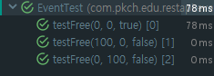

# 2018 12.23 Sunday

## - Spring Restful API

1. 매개변수를 이용한 테스트

**JUnitParams**로 매개변수 테스트 하기

[참고 / JUnitParams github](https://github.com/Pragmatists/JUnitParams)

```groovy
testImplementation('pl.pragmatists:JUnitParams:1.1.1')
```

파라미터를 사용한 테스트 코드를 쉽게 만들어주는 프로젝트
JUnit은 기본적으로 Method Parameter를 가질 수 없는데 Method Parameter를 넣어 파라미터 값이 변할 때 테스트 코드를 작성하기 용이하도록 도와준다.

```java
@RunWith(JUnitParamsRunner.class)
public class EventTest {
// ...
@Test
@Parameters({
    "0, 0, true",
    "100, 0, false",
    "0, 100, false"
})
public void testFree(int basePrice, int maxPrice, boolean isFree){
    // given
    Event event = Event.builder()
            .basePrice(basePrice)
            .maxPrice(maxPrice)
            .build();
    // when
    event.update();
    // then
    assertThat(event.isFree()).isEqualTo(isFree);
}
// ...
}
```

JUnitParams를 사용하기 위해서는 **@Runwith(JUnitParamsRunner.class)**를 명시하여 Runner를 설정해야한다.

이렇게 설정하면 같은 테스트 코드에 파라미터만 다른 경우를 중복을 제거하여 손쉽게 테스트할 수 있다.

위 예제처럼 JUnitParams가 제공하는 **@Parameter** 어노테이션을 붙여주고 method parameter에 들어가야하는 값들을 문자열 형태로 제공할 수 있다.



이렇게 @Parameters에 넣은 3개에 문자열에 대해 각각 순서대로 메서드 파라미터에 매핑되고 테스트 결과를 각각의 파라미터에 대하여 보여준다.

하지만 위 @Parameters에 들어간 문자열은 type safe 하지 못하다. 이를 해결하기 위해서 method 형태로 parameter를 제공해 줄 수 있다.

```java
private Object[][] parametersForTestFree(){
    new Object[][]{
        new Object[]{0, 0, true},
        new Object[]{100, 0, false},
        new Object[]{0, 100, false}
    }
}
// ...
@Parameters(method = "parametersForTestFree")
```

위와 같이 parameter를 정의한 Object 배열로 제공가능하다.

이 때, 위 예제는 @Parameters에 method 값 없이 그냥 @Parameters를 붙인 것과 같은 결과가 나온다. 이는 JUnitParams의 convention이 적용되기 때문이다.

> method 이름이 `parametersFor{test method 이름}`이라면 @Parameters가 자동으로 해당 메서드를 찾아 파라미터로 등록한다. 

2. Spring HATEOAS

[공식문서](https://docs.spring.io/spring-hateoas/docs/0.25.0.RELEASE/reference/html/)

Spring HATEOAS는 Restful API를 만들 때 보다 쉽게 제공하기 위한 일종의 tool을 제공해주는 일종의 라이브러리

> HATEOAS?
>
> REST application architecture 중 하나의 구성요소로 hypermedia를 이용하여 server의 정보를 client가 동적으로 정보를 주고받을 수 있는 방법

```
<!-- 잔액이 있는 경우 -->
HTTP/1.1 200 OK
Content-Type: application/xml
Content-Length: ...

<?xml version="1.0"?>
<account>
    <account_number>12345</account_number>
    <balance currency="usd">100.00</balance>
    <link rel="deposit" href="https://bank.example.com/accounts/12345/deposit" />
    <link rel="withdraw" href="https://bank.example.com/accounts/12345/withdraw" /> 
    <link rel="transfer" href="https://bank.example.com/accounts/12345/transfer" />
    <link rel="close" href="https://bank.example.com/accounts/12345/status" />
</account>

<!-- 잔액이 마이너스인 경우 -->
HTTP/1.1 200 OK
Content-Type: application/xml
Content-Length: ...

<?xml version="1.0"?>
<account>
    <account_number>12345</account_number>
    <balance currency="usd">-25.00</balance>
    <link rel="deposit" href="https://bank.example.com/accounts/12345/deposit" />
</account>
```

***이렇게 Restful API는 상태에 따라 전이할 수 있는 동적 링크를 다르게 제공해주어야한다!***

[참고](https://en.wikipedia.org/wiki/HATEOAS)

이렇게 **Spring HATEOAS**는 리소스를 만들어 주는 기능 / 링크를 만들어 주는 기능 / 링크를 찾아주는 기능을 제공해준다.

링크를 만드는 방법은 직접 Spring HATEOAS의 Link 객체를 추가하는 방법과 LinkBuilder를 이용하는 방법이 있다.

```java
linkTo("http://localhost:8089/event/1")
linkTo(Controller.class).slash(event.getId()).withSelfRel();
```
위 예시처럼 ControllerBuilder에 linkTo 메서드로 링크 정보를 Rest API에 담아 줄 수 있다.

> 그외 methodOn() 방법과 EntityLinks 활용 방법은 추후...

리소스를 만드는 방법은 ResourceSupport 상속과 Resource<T>를 상속하는 방법 2가지가 있다.

```java
public class EventResource extends ResourceSupport{
    @JsonUnwrapped
    private Event event;

    public EventResource(Event event){
        this.event = event;
    }

    public Event getEvent(){
        return this.event;
    }
}
```
위 방식으로 EventResource를 정의하여 Event 정보에 Link 정보를 담은 리소스를 생성할 수 있다. 다만, 문제점은 객체를 json으로 Serialize 해주는 ObjectMapper의 BeanSerializer가 Event객체의 event 이름을 그대로 사용한다. 따라서 event 정보가 "event"에 한번 감싸져서 restful api로 나타난다. 이를 해결하기 위해서 **@JsonUnwrapped**를 Event 위에 붙여주면 해결되긴 한다. 이 외 다른 방법으로는 ResourceSupport를 상속받은 Resource<T>를 상속해줄 수도 있다.

```java
public class EventResource extends Resource<Event>{
    public EventResource(Event event, Link... links){
        super(event, links);
    }
}
```
위와 같이 정의하면 ResourceSupport를 상속받아 Resource를 만든 코드와 똑같이 적용된다. 이때, Resource<T>의 getContent() 메서드에 @JsonUnwrapped가 붙어있기 때문에 @JsonUnwrapped 어노테이션 없이도 똑같이 Resource가 나오는 것이다.

이렇게하면 Restful API 요건에서 HATEOAS를 충족할 수 있다.

Restful API에서 self-description을 충족하는 방법은 **Spring REST Docs** 라이브러리를 이용하여 해결할 수 있다.

[Spring REST Docs 공식문서](https://docs.spring.io/spring-restdocs/docs/2.0.3.RELEASE/reference/html5/)


## - 데이터 사이언스 by python

- numpy

- pandas