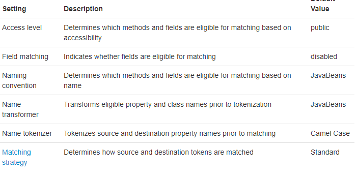
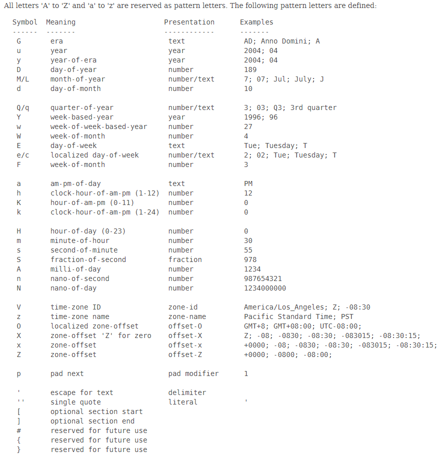

# 2019 01.13 Sunday

1. Spring Restful API

    - ModelMapper

        > ModelMapper?
        >
        > ModelMapper는 쉽게 Object Model을 다른 Object Model로 매핑해주는 프로젝트이다.
        >
        > 이번 Restful API에서는 입력값으로 받은 DTO 객체를 Entity 객체로 만들어주기 위해 사용한다.
        
        ModelMapper는 Spring Boot에서 관리하는 프로젝트가 아니므로 아래와 같이 의존성 추가가 필요하다.

        ```xml
        <!-- maven -->
        <dependency>
            <groupId>org.modelmapper</groupId>
            <artifactId>modelmapper</artifactId>
            <version>2.3.0</version>
        </dependency>
        ```

        ```groovy
        // gradle
        implementation('org.modelmapper:modelmapper:2.3.0')
        ```

        ModelMapper는 2가지 과정으로 Object Model을 매핑한다. 바로 Matching Process와 Mapping Process이다.

        1. Matching Process
 
            Matching Process는 `ModelMapper`에 설정된 convention을 사용하거나 객체 데이터와 결과 속성을 매칭하기 위해 사용하는 `TypeMap`을 이용한다.

            적절한 속성에 대해 해당 속성의 이름으로 `transforming`과 `tokenizing`이 이뤄지고 매칭한다.

            이때 적절한 속성은 다음과 같이 결정된다. 먼저 field matching을 사용하면 ModelMapper 설정시에 설정한 `AccessLevel`에 따라 접근하며 마찬가지로 설정한 `NamingConvention`에 따라 이름 지어진 field를 대상으로 Mapping 대상을 설정한다. (Method 또한 마찬가지)

            > 이때 Method의 경우는 source method가 파라미터가 존재하지 않고 return type이 void가 아닌 경우(getter)와 함께 destination 메서드가 한개의 파라미터가 존재하고 return type이 void여야 가능하다.(setter)

            이후 `Name Transformation`이 진행된다. 즉, 대상(source) property의 이름을 타겟(destination) 프로퍼티의 이름으로 바꾸는 작업을 의미한다.

            일반적으로 `NameTransformer`는 `NamingConvention`과 같은 방식으로 property 이름을 바꾼다. 따라서 보통은 함께 설정한다. (JavaBean과 비슷)

            Transformation이 끝나면 token화 한다.

            token화한 정보를 가지고 `matching`이 이뤄진다. 이때 `MatchingStrategies`가 사용된다.

        2. Mapping Process

            `Matching`이 끝나면 `Mapping Process`로 각 Object Model을 매핑한다. 다음 순서로 Mapping Process가 진행된다.

            * 먼저, 대상 모델과 타겟 모델에 대한 `TypeMap`이 존재하면 `TypeMap`에 정의한 Mapping 방식에 따라 매핑한다.
            
            * `TypeMap`이 아닌 `Converter`가 존재한다면 `Converter`를 사용하여 매핑한다.

            * 둘다 존재하지 않는다면 새로운 `TypeMap`을 만들고 암묵적으로 매핑이 이뤄진다.

        이러한 흐름으로 매핑이 이뤄진다.

        

        [modelmapper 설정 참고](http://modelmapper.org/user-manual/configuration/)
        [Type Map Inheritance](http://modelmapper.org/user-manual/type-map-inheritance/)

    [ModelMapper 공식 사이트 참고](http://modelmapper.org/)

    ```java
    @Configuration
    public class AppConfig {

        @Bean
        public ModelMapper modelMapper(){
            return new ModelMapper();
        }
    }
    ```
    다음과 같이 ModelMapper를 사용하기 위해 빈등록을 했습니다.

    ```java
    @PostMapping("/")
    public ResponseEntity<?> createTodo(@RequestBody TodoDto todoDto){
        Todo todo = modelMapper.map(todoDto, Todo.class);
        Todo savedTodo = todoRepository.save(todo);

        ControllerLinkBuilder linkBuilder = linkTo(TodoController.class).slash(savedTodo.getId());
        URI uri = linkBuilder.toUri();
        TodoResource todoResource = new TodoResource(savedTodo);
        todoResource.add(
                linkTo(TodoController.class).withRel("create-todo"),
                linkBuilder.withRel("update-todo")
        );
        return ResponseEntity.created(uri).body(todoResource);
    } // 할일 등록
    ```

    그리고 위와 같이 `todoDto` Source Object를 Todo Destination Object로 바꾸기 위해 사용했습니다.

    - Spring Data Validation

    - Spring Rest Docs

        > Junit 테스트를 이용하여 API Docs를 만들어내는 프로젝트
        >
        > `@AutoConfigureRestDocs`를 테스트 클래스 위에 붙여주어야 한다.

    [Spring Rest Docs Guide](https://spring.io/guides/gs/testing-restdocs/)
    [Spring Rest Docs 공식 문서](https://docs.spring.io/spring-restdocs/docs/2.0.3.RELEASE/reference/html5/)

    - jsonPath 테스트 시 유의사항

        1. json을 String 형식으로 만들었기 때문에 테스트 할때 값도 String으로 만들어 테스트 할 것!

    - Page

        Spring MVC에서 Page를 다룰때 줄 수 있는 속성 3가지가 있다.

        1. size
            해당 페이지에서 보여주는 element의 수를 의미
        2. page
            몇번째 페이지인지 알려주는 속성
        3. sort
            어떤 속성을 기준으로 정렬하는 속성

    - java 8 localdatetime 계산하기

        계산을 너무 복잡하게 생각한 것 같다.
        `Localdatetime` 객체에서 제공하는 `plusDays`, `plusWeeks`, `plusMonths` 등을 사용하면 편하게 날짜 계산을 할 수 있다.

        ```java
        DateTimeFormatter formatter = DateTimeFormatter.ofPattern("yyyy-MM-dd HH:mm:ss");
        LocalDateTime now = LocalDateTime.now();
        LocalDateTime afterOneDay = now.plusDays(1);
        System.out.println(now); // 2019-01-13T15:14:57.980592
        System.out.println(afterOneDay.format(formatter)); // 2019-01-14 15:14:57
        LocalDateTime afterAWeek = now.plusWeeks(1);
        System.out.println(afterAWeek.format(formatter)); // 2019-01-20 15:14:57
        LocalDateTime beforeTwoWeek = now.minusWeeks(2);
        System.out.println(beforeTwoWeek.format(formatter)); // 2018-12-30 15:19:42
        ```

        위와 같이 현재시간`now`를 기준으로 하루, 일주일 차이의 날짜를 계산할 수 있다.

        또한 formatter를 이용하여 기본으로 출력되는 값을 다른 방식으로 바꿀 수 있다.

        아래 캡쳐는 공식문서에서 제공하는 formatter 방식이다.

        
        