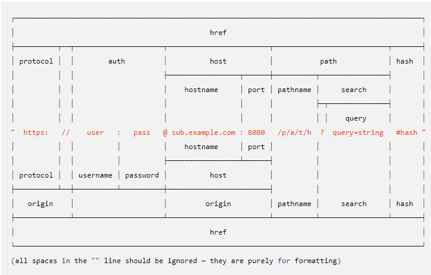

# 2019 01.04 Friday

# 1. Node.js

## Node.js 내장객체

- global

javascript에는 2가지 실행환경이 있다.

1. Browser run time environment
2. Node run time environment

두 실행환경의 전역 변수 설정방법이 각각 다르다.

먼저 `Browser`의 경우는 전역 객체를 `window`로 전역 변수를 설정할 수 있다.

```javascript
// browser
var a = 10

console.log(a) // 10
console.log(window.a) // 10
window.console.log(a) // 10
```

위와 같이 전역 변수로 설정한 값을 window 객체에서 불러올 수 있다.
또한, window 객체 없이 그냥 값을 불러올 수도 있는데 이는 browser javascript의 모든 변수 / 함수는 `window` 객체 내부에서 관리되기 때문이다.

반면 `Node`실행 환경에서는 window가 아닌 global을 전역 객체로 가진다.

```javascript
// Node
var a = 10

console.log(a) // 10
console.log(global.a) // undefined
global.console.log(a) // 10
```

위 예시와 같이 global 전역객체를 통해 Node의 내장 객체인 console 객체를 불러 올 수 있다.

다만, `Browser` 실행환경과는 달리 바깥에서 선언한 변수는 global 객체의 변수가 되지 않는다!

`Browser` 실행환경에서는 만약 파일 2개에서 같은 이름으로 전역변수가 선언됐다면 나중에 불려진(load) 파일의 변수를 쓴다. 하지만 `Node` 실행환경에서는 전역으로 선언된 변수의 범위는 오직 `파일 내부`로 한정되어있다.

따라서, 다른 모듈에 있는 전역 변수는 같은 이름이더라도 다른 변수로 취급된다.

다른 모듈의 변수와 메서드를 불러오기 위해서는 명시적으로 export된 변수를 import 해야 한다.

### global 전역 객체에서 자주사용하는 변수 / 메서드

1. __dirname

> 현재 모듈의 directory name을 가진 전역 변수

`__dirname` 변수는 `path.dirname()`과 같은 값을 가진다.

2. __filename

> 현재모듈의 파일의 절대경로를 가진 전역변수 (현재 시스템의 symlinks)

[심볼릭 링크란?](https://ko.wikipedia.org/wiki/%EC%8B%AC%EB%B3%BC%EB%A6%AD_%EB%A7%81%ED%81%AC)

3. require(module name: string)

> 다른 모듈을 가져오는 global function

```javascript
const util = require("util"); // 내장모듈 util import
const express = require("express"); // 외장모듈 express import
const controller = require("./controller") // 내부 파일모듈 import
```

4. Timer 함수

> setTimeout / setInterval / setImmediate
>
> clearTimeout / clearInterval / clearImmediate

- setTimeout(callback: function, time: integer)

    주어진 time(밀리초, Millsecond)이후에 콜백 함수를 실행한다. (1번만)

    ※ 1000 밀리초에 1초

- setInterval(callback: function, time: integer)

    주어진 time(밀리초, Milisecond)마다 콜백 함수를 실행한다. (실행 후 밀리초마다)

- setImmediate(callback: function)

    콜백함수를 즉시 실행하는 타이머 함수

    ```javascript
    setTimeout(function(){
        console.log("1초 지났습니다.");
    }, 1000);

    setTimeout(function(){
        console.log("3초마다 실행")
    }, 3000);

    setImmediate(function(){
        console.log("즉시 실행")
    });
    ```

    위와 같이 타이머 함수를 사용할 수 있다.

    타이머 함수들은 모두 고유한 id를 반환한다. 이 아이디를 이용하여 clear<something>으로 타이머를 취소할 수 있다.

    > setImmediate와 setTimeout(callback, 0)
    >
    > 위 두 함수에 담긴 callback은 이벤트 루프를 거친 뒤 즉시 실행된다.
    >
    > 보통의 경우 setTimeout(callback, 0)이 setImmediate보다 먼저 실행되지만, 파일 시스템 접근, 네트워킹 등의 I/O 작업 내에서의 callback은 setImmediate가 먼저 호출이 된다.
    >
    > 다만, 의미에 맞게 setTimeout(callback, 0)을 사용하기 보다 setImmediate를 사용하는 것이 권장된다.

5. 그외..

그외 process, console, module, exports 등의 global 객체는 아래 section에서 더 자세히 다루도록 합니다

[Node.js global 공식문서](https://nodejs.org/api/globals.html)
[참고](https://codeburst.io/node-js-getting-started-4c671313a1ae)

- console 객체

> console 객체는 javascript console에서 간단한 디버깅 기록을 제공해준다.

console 객체는 주로 2가지 형태로 사용한다.

1. method 사용

    - console.log()

        javascript 콘솔에서 log에 들어갈 인자를 출력해주는 함수

    - console.error()

        `log()`와 비슷하지만 error 메세지 형태로 콘솔에 출력

    ```javascript
    // 사용사례
    console.log('hello world');
    // Prints: hello world, to stdout
    console.log('hello %s', 'world');
    // Prints: hello world, to stdout
    console.error(new Error('Whoops, something bad happened'));
    // Prints: [Error: Whoops, something bad happened], to stderr

    const name = 'Will Robinson';
    console.warn(`Danger ${name}! Danger!`);
    // Prints: Danger Will Robinson! Danger!, to stderr
    ```
2. console 객체 생성

    console 객체를 커스텀하여 log를 출력할 수 있다.

    ```javascript
    const { Console } = require("console");
    // 또는
    const { Console } = console;
    ```

    위는 console 객체 생성자를 받아오는 코드이다.

    위 Console 생성자로 다음과 같이 console 객체를 생성할 수 있다.

    ```javascript
    new Console(stdout[, stderr][, ignoreErrors])
    new Console(options)
    ```

    위 `options: object`에는 다음과 같은 값이 있을 수 있다.

    - stdout: stream.Writable - 표준출력
    - stderr: stream.Writable - 표준에러
    - ignoreErrors: boolean / default: true
        stream에서 값을 쓸 때 error를 무시할지 말지 여부 결정
    - colorMode: boolean / string(default: 'auto')

    참고로 global console 객체는 다음 Console 개체를 반환한다.

    ```javascript
    new Console({ stdout: process.stdout, stderr: process.stderr });
    ```

[참고](https://nodejs.org/api/console.html)

- process 객체

현재 실행중인 Node.js 프로그램의 실행 `instance` 정보를 가지는 객체

주로 env 변수를 사용한다. (환경변수를 다루기 위해)

```javascript
process.env.DB_NAME === "test"
// 환경변수에 등록된 DB_NAME의 값이 "test"인 경우
```

- URL / URLSearchParams

Node.js의 URL은 WHATWG의 URL 표준을 따른다.
[WHATWG URL API 참고](https://url.spec.whatwg.org/)



> 중간의 주소 위쪽의 기존의 Node URL 체계, 아래쪽이 WHATWG 방식이다.

URL 객체 생성하기

```
new URL(input: string[, base: string | url])
```
위 양식으로 URL 객체를 만든다.

input은 파싱할 url이 들어간다. 절대경로, 상대경로 모두 가능하지만 상대경로라면 base는 무조건 필요하다.

```javascript
const testURL = new URL('/foo', 'https://example.org/');
// https://example.org/foo

let myURL = new URL('http://Example.com/', 'https://example.org/');
// http://example.com/

myURL = new URL('https://Example.com/', 'https://example.org/');
// https://example.com/

myURL = new URL('foo://Example.com/', 'https://example.org/');
// foo://Example.com/

myURL = new URL('http:Example.com/', 'https://example.org/');
// http://example.com/

myURL = new URL('https:Example.com/', 'https://example.org/');
// https://example.org/Example.com/

myURL = new URL('foo:Example.com/', 'https://example.org/');
// foo:Example.com/
```

URL 객체의 property는 WHATWG의 구성요소를 가진다.

- hash

    html의 id 속성에 해당하는 정보

    ```javascript
    const myURL = new URL('https://example.org/foo#bar');
    console.log(myURL.hash);
    // Prints #bar

    myURL.hash = 'baz';
    ```

- host

    url의 host 부분을 제공 (protocol, hostname, port)

    ```javascript
    const myURL = new URL('https://example.org:81/foo');
    console.log(myURL.host);
    // Prints example.org:81

    myURL.host = 'example.com:82';
    ```

- hostname

    url의 hostname을 제공

    ```javascript
    const myURL = new URL('https://example.org:81/foo');
    console.log(myURL.hostname);
    // Prints example.org

    myURL.hostname = 'example.com:82';
    ```

- href

    현재 등록된 url 전체를 제공해주는 property로 url.toString()과 같은 역할을 한다.
    
    ```javascript
    const myURL = new URL('https://example.org/foo');
    console.log(myURL.href);
    // Prints https://example.org/foo
    ```

- origin

     url origin 정보 제공 (단, read-only)

    ```javascript
    const myURL = new URL('https://example.org/foo/bar?baz');
    console.log(myURL.origin);
    // Prints https://example.org
    ```

- password

    url의 password 정보 제공

- pathname

    url의 pathname 정보 제공, origin 이후에 오는 url에 해당

    ```javascript
    const myURL = new URL('https://example.org/abc/xyz?123');
    console.log(myURL.pathname);
    // Prints /abc/xyz
    ```

- port

    url의 port 정보 제공

- protocol

    url의 protocol 정보 제공

- search

    url에 있는 querystring 목록을 제공 (string으로 제공)

- username

    url의 username 정보 제공

※ URLSearchParams

URLSearchParams는 read-only로 querystring parameter를 참조할 수 있다. 만약 querystring을 수정해야한다면 url.search를 이용하여 수정한다.(URLSearchParams의 setter)
