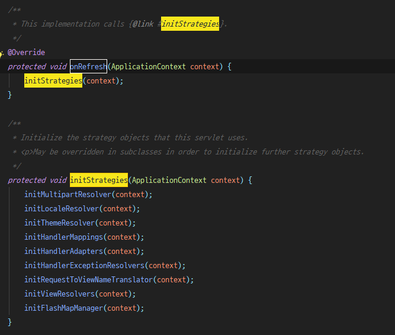
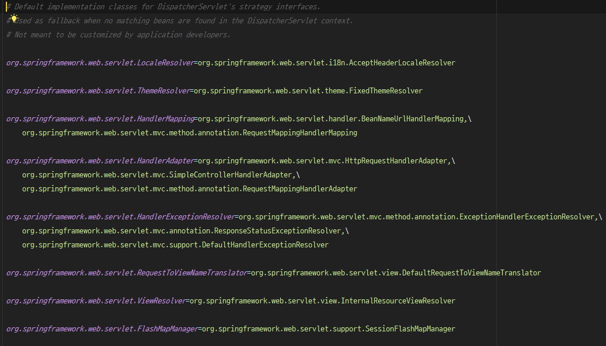
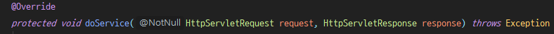
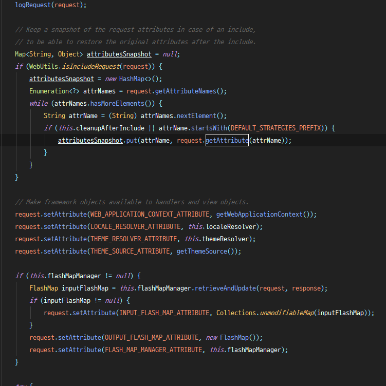

# 2019.07.11 Thursday

# 1. DispatcherServlet

DispatcherServlet은 Spring에서 Controller에 요청을 전달하기 전 모든 요청을 받는 Front Controller의 역할을 한다. 먼저 Spring 서버로 들어오는 요청을 DispatcherServlet이 가로챈 후 각 컨트롤러로 해당 요청을 매핑해준다.

front-controller-pattern 참고 : [https://nesoy.github.io/articles/2017-02/Front-Controller](https://nesoy.github.io/articles/2017-02/Front-Controller)

## strategies

DispatcherServlet에서 어떤 HandlerMapping 전략을 어떻게 줄 것인지, HandlerAdapter는 어떤걸 사용할 것인지, view resolver는 어떤 것을 사용할 것인지 등의 전략...

기본적으로 DispatcherServlet의 getDefaultStrategies 메서드를 통해 각각의 전략을 설정한다. 이 전략들은 처음에 WebApplicationContext가 초기화 될 때 onRefresh() 메서드를 통해 초기 설정된다.

참고 : org.springframework.web.servlet.FrameworkServlet

DispatcherServlet은 FrameworkServlet 추상 메서드를 상속받는다. 이때 FrameworkServlet에서 

initWebApplicationContext()를 통해 onRefresh를 호출하여 각종 전략을 설정한다. 위 initStrategies에서 호출하는 initXX 메서드들이 각 전략을 설정하는 요소들이다. 참고로  `DispatchServlet.properties` 파일에서 설정한 내용으로 strategy를 설정한다.

위와 같이 설정된 내용을 바탕으로 strategy를 설정한다.

## Dispatch

DispatcherServlet답게 Dispatch, 즉, 요청을 컨트롤러에 넘겨주는 작업을 한다. DispatcherServlet의 `doDispatch()` 메서드가 이를 담당한다. 

이때 doDispatch를 호출하기 전, 전처리 작업을 위해 doService()를 호출하여 실행한다.

doService는 FrameworkServlet 추상클래스의 추상메서드이다. doService를 통해 DispatcherServlet에서의 요청처리를 구현한 것이다.

### - HttpServlet의 요청처리

기본적으로 요청 경로로 클라이언트에서 요청이 들어오면 해당 HttpMethod에 따라 doXXX() 메서드가 호출된다. 이는 javax.servlet.http.HttpServlet의 service 메서드를 참고

### - DispatcherServlet의 dispatch 전처리 작업

request에 대한 log출력 → request attribute 백업 → framework object를 request에서 사용할 수 있도록 attribute 설정 → flashMap 사용한다면 FlashMap 설정

위 작업 이후 컨트롤러로 요청을 dispatch한다.

참고로 DispatcherServlet은 `/`와 .jsp로 끝나지 않는 파일 경로에 대해서 처리를 할 수 있다. 즉, `/css/index.css` 와 같은 요청을 DispatcherServlet이 처리한다는 의미이다. 이는 `@Controller`로 매핑된 경로를 찾아 연결하는 HandlerMapping과 다른 차이점이다.

### - doDispatch

DispatcherServlet의 doDispatch() 메서드에서 dispatch 관련 작업을 진행한다.  

이때 핸들러 설정, MultipartResolver 사용에 따른 설정을 한다.

handler 설정의 경우 해당 요청에 대한 주요 handler와 이전 처리 (preHandle), 이후 처리 (postHandle)를 HandlerExecutionChain으로 가져온다.

이렇게 가져온 HandlerExecutionChain을 HandlerAdapter를 이용하여 실행한다. 먼저, preHandle이 존재한다면 먼저 preHandle을 실행, 그리고 해당 요청의 로직을 수행한 후 postHandle을 수행한다.

HandlerMapping 우선순위 및 MVC 동작 참고 :  [https://tinkerbellbass.tistory.com/40](https://tinkerbellbass.tistory.com/40)

## HandlerMapping VS HandlerAdapter

DispatcherServlet이 클라이언트에게서 요청받은 경로를 파악하고 handler를 찾을때는 `HandlerMapping`을 사용한다. 그리고 `HandlerMapping`으로 찾은 handler (정확히는 HandlerExcecutionChain)를 실행하기 위해서 `HandlerAdaapter`를 사용한다.

### HandlerMapping이 @Controller와 @RequestMapping을 파악하는 원리

위 `@Controller`와 `@RequestMapping`은 RequestMappingHandlerMapping을 통해 Handler로써 작용할 수 있는지 판단한다.

# 2. JPA