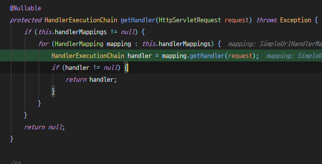
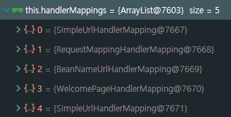
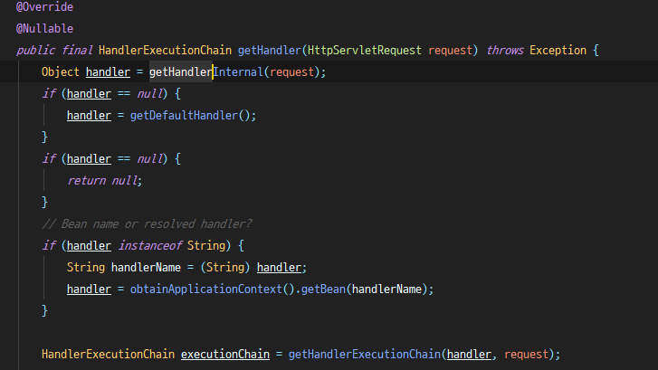
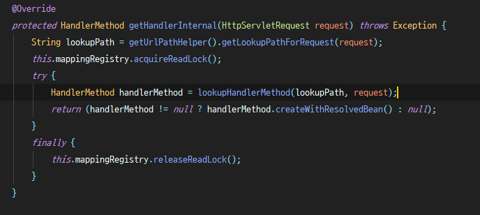
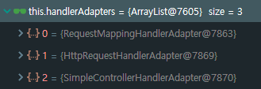
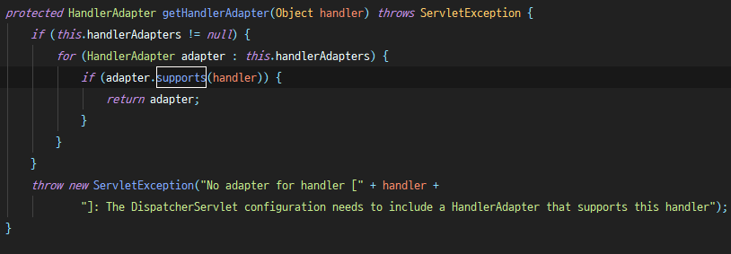

# 2019.07.12 Friday

## HandlerMapping VS HandlerAdapter

DispatcherServlet이 클라이언트에게서 요청받은 경로를 파악하고 handler를 찾을때는 `HandlerMapping`을 사용한다. 그리고 `HandlerMapping`으로 찾은 handler (정확히는 HandlerExcecutionChain)를 실행하기 위해서 `HandlerAdaapter`를 사용한다.

> 아래는 @RequestMapping 기반의 경로 설정시의 dispatch 흐름이다.

- HandlerMapping

  DispatcherServlet는 클라이언트에서 받은 요청을 HandlerMapping의 도움을 받아 적절한 handler를 찾는다. 아래는 DispatcherServlet에 등록된 HandlerMapping을 통해 요청에 적절한 handler를 찾는 `getHandler` 메서드이다.

  

  Spring boot에서는 기본적으로 5가지 HandlerMapping을 제공해준다. 이때 for문으로 우선하는 HandlerMapping은 다음과 같다.

  

  위 HandlerMapping 구현체의 순서대로 HandlerMapping의 getHandler를 호출하여 적절한 컨트롤러의 핸들러 메서드를 찾는다. 

  

  getHandler는 `AbstractHandlerMapping`에서 구현한 메서드이다. 이곳에서 `AbstractHandlerMapping`의 추상메서드인 `getHandlerInternal`을 통해 적절한 핸들러 메서드를 찾는다. getHandlerInternal은 추상메서드이므로 `RequestMappingHandlerMapping` 등과 같은 각 구현체에서 구현한 `getHandlerInternal`을 사용한다.

  아래 `getHandlerInternal`은 `RequestMappingHandlerMapping`이 상속하는 `AbstractHandlerMethodMapping`에서 구현하는 `getHandlerInternal`이다.

  

  즉, 위 메서드가 해당 요청에 알맞는 핸들러를 찾는 주요 로직이 된다. `lookupHandlerMethod`로 요청 경로와 request 객체를 이용해 HandlerMethod를 찾는 것이다. 이 메서드에서 요청에 알맞는 Match 객체(HandlerMethod를 관리)를 가져온 후 현재 요청에 가장 적절한 HandlerMethod를 매핑하게 된다.

- HandlerAdapter

  Spring boot에서는 기본적으로 3가지 HandlerAdapter를 제공해준다. 이때 for문으로 우선하는 HandlerAdapter는 다음과 같다.

  

  이때 `RequestMappingHandlerAdapter`의 경우 실행 지원을 해주므로 `RequestMappingHandlerAdapter`의 인스턴스가 반환된다.

  

  그렇게 `HandlerAdapter`를 가져오면 adapter를 통해 handler 실행 전처리(PreHandle) → 실행 → 후처리 (PostHandle)를 한다. 이렇게 요청에 대한 서버에서의 처리가 끝나면 processDispatchResult 메서드를 호출하여 현재 프로젝트에서 사용하고 있는 ViewResolver로 적절한 파일을 랜더링한다.