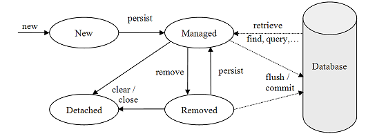

# 2019.07.15 Monday

# Manage Persistence (영속성 관리)

## Entity

Entity는 `@Entity`어노테이션이 붙은 클래스로써 반드시 식별자(`@Id`) 값을 가져야한다.

이는 Persistence Context에서 식별자를 기준으로 Entity를 판단하기 때문이다.

Entity는 POJO로 구현된다. (물론, JPA의 일부 어노테이션이 들어가지만,,)

그럼 굳이 Entity가 자신이 `persist` 상태인지 아닌지 알고있을까? 답은 아니다. Persistence Context가 외부에서 Entity를 감시하는 역할로 Entity의 상태를 관리하고 있기 때문에 Entity는 현재 자신의 상태를 알지 못한다. 즉, 영속성 관련 개념은 Persistence Context가 가지고 있음을 알 수 있다.

## EntityManagerFactory와 EntityManager

이전 Basic에서 둘 사이의 관계를 알아보았다. 이번에는 좀 더 보충하여 알아보겠다.

EntityManagerFactory는 한 애플리케이션에서 공유하여 사용할 수 있도록 설계되었다고 학습하였다. 때문에 EntityManagerFactory를 하나 만드는데 걸리는 비용은 매우 크지만 EntityManagerFactory에서 EntityManager를 생성하는 비용은 거의 들지 않도록 설계되었다.

EntityManager는 DB 연결이 꼭 필요한 시점까지 커넥션을 얻지 않는다. 일례로 EntityManager가 트랜젝션을 얻을 때까지는 DB 커넥션을 얻지 않는다.

## Persistence Context

JPA에서 가장 중요한 용어인 Persistence Context(영속성 컨텍스트)이다. Entity를 영구 관리하는 환경을 의미한다.

```java
// ...
em.persist(user);
// ...
```

User라는 테이블에 `user` Entity를 저장한다고 가정한다. 위 persist는 저장하는 의미도 되지만 정확히는 Persistence Context에 저장하는 것이다. Persistence Context는 EntityManager가 만들어질때 하나 만들어진다. 그리고 EntityManager를 통해 Persistence Context에 접근 및 관리할 수 있다.

## Entity LifeCycle



> 출처 : [https://blog.woniper.net/266](https://blog.woniper.net/266)

위 그림과 같이 Hibernate Entity는 4가지 LifeCycle을 가진다.

1. 비영속 `new/transient` : Persistence Context가 관리하지 않는 Entity
2. 영속 `persist/managed` : Persistence Context가 관리하는 Entity
3. 준영속 `detached` : Persistence Context에 저장되었다가 이제는 관리하지 않는 상태. 단, DB에는 데이터가 남아있음
4. 삭제 `removed` : 완전히 삭제된 상태

### 준영속 `detached`

특정 Entity를 더이상 관리하지 않도록 만드려면 `em.detached()`를 사용하거나 `em.close()`로 Persistence Context를 닫아버림으로서 준영속 상태로 만들 수 있다. 또한 `em.clear()`로 PersistenceContext를 초기화해버려도 준영속상태가 된다. 더이상 해당 Entity를 관리하지 않기 때문이다.

### 삭제 `removed`

Entity를 Persistence Context와 DB에서 삭제된 상태이다. `em.remove()`로 삭제 상태로 변경할 수 있다.

## Persistence Context의 특징

1. 식별자 값

   Persistence Context는 엔티티를 식별자 값으로 구분한다. 이때 식별자는 `@Id`로 테이블의 PK와 매핑된 값을 의미한다. 영속성 컨텍스트에서 식별자는 반드시 있어야하며 없을시 예외가 발생한다.

2. flush

   Persistence Context가 관리하는 Entity가 DB와 동기화 될 때 `flush`라고 한다. 보통 Persistence Context가 커밋되는 순간에 flush된다. 이와 별개로 강제로 flush를 호출할 수도 있다.

3. 장점

   - 1차 캐싱
   - 동일성 보장
   - 트랜잭션을 지원하는 쓰기 지연
   - 변경 감지
   - Lazy Loading

### CRUD

1. 조회 (Read)

Persistence Context는 내부에 캐시를 가지고 있다. 이를 1차 캐시라고 한다. Entity를 Persistence Context에 `persist`하면 모두 1차 캐시에 저장된다.

1차 캐시의 키는 `@Id`로 설정한 식별자이다. 그리고 그 값은 DB에 실제 저장된 PK이다.

조회는 EntityManager에서 `find()`메서드를 호출하여 실행한다. 이때 Persistence Context의 1차 캐시를 먼저 탐색하는데 만약 1차 캐시에 조회하려는 식별자가 없다면 DB를 조회하여 Entity를 생성한 후 Persistence Context에 저장하고 반환한다.

```
public <T> T find(class<T> entityClass, Object primaryKey) 
```

Persistence Context는 1차 캐싱을 통해 DB 수준에서가 아니라 애플리케이션 수준에서 트랜잭션 격리 수준을 제공한다.

Persistence Context는 항상 동일한 식별자를 가지는 Entity를 조회하면 등일한 Entity를 반환한다.

2. 등록 (Create)

Persistence Context에 persist를 할때마다 1차 캐시에 저장된다. 이때 저장될 때마다 DB에 쿼리를 날려 저장하는 것이 아니라 내부 쿼리 저장소에 SQL을 쌓아둔다. 최종 DB 저장은 트랜잭션이 커밋 될 때 수행되도록 한다. 이를 **트랜잭션을 지원하는 쓰기 지연**이라 한다.

- 트랜잭션을 지원하는 쓰기 지연이 가능한 이유

  바로 트랜잭션 때문에 가능하다. 매번 1차 캐시에 저장할 때마다 등록 쿼리를 DB에 날리거나 모아서 날리거나 상관없이 트랜잭션이 커밋되야 결국 DB에 반영된다. 즉, 커밋 직전에만 DB에 SQL문을 전달하면 되는 것이다.

3. 수정 (Update)

Persist 상태의 Entity의 값이 변경될 때마다 Persistence Context가 변경을 감지하여 1차 캐시에 반영한다. 어떻게 가능할까?

- 변경 감지

  Persistence Context는 Entity를 보관할 때 최초 상태를 복사하여 저장한다. 이를 **스냅샷**이고 한다. 그리고 `flush`할 떼 스냅샷과 현재 저장된 Entity를 비교하여 수정부분을 찾게 된다.

  단, 위 변경 감지는 persist 상태의 Entity만 해당된다.

이렇게 변경감지로 UPDATE 쿼리가 내부 쿼리 저장소에 저장되고 `flush`시에 DB에 반영된다. 이때, JPA는 변경된 컬럼에 대해서만 쿼리를 날리는 것이 아니라 **모든 필드를 업데이트하는 쿼리**를 DB에 보낸다. 이는 DB에 보내는 데이터 전송량이 증가하는 단점이 있지만 다음 2가지 장점으로 JPA는 모든 필드를 업데이트한다.

a. 어떤 컬럼을 수정하더라도 수정 쿼리가 같다. 때문에 애플리케이션 로딩 시점에 수정 쿼리를 미리 생성하고 모든 필드를 업데이트한다.

b. DB에 동일한 쿼리를 보내면 DB는 이전에 한 번 파싱된 쿼리를 재사용할 수 있다.

※ 참고

컬럼이 많은 경우나 저장되는 내용이 많다면 동적으로 SQL을 생성하는 전략을 사용할 수 있다. `@DynamicUpdate`로 수정된 데이터만을 사용하여 동적 UPDATE SQL을 생성한다. 마찬가지로 INSERT SQL도 동적으로 만들 수 있다. (`@DynamicInsert`)

> 일반적으로 컬럼이 30개 이상인 경우 동적 수정 쿼리가 빠르다고 한다.

4. 삭제 (Delete)

삭제를 위해서는 먼저 Persistence Context에 Entity를 조회해야한다. 이를 `remove`메서드를 사용하여   엔티티 삭제를 할 수 있다.

이렇게 삭제된 Entity는 Persistence Context에서 제거되므로 재사용하지 않아야한다.

## flush

지금까지 봤듯이 `flush`는 Persistence Context와 DB를 동기화하는 작업이다. flush가 발생하면 Persistence Context의 내부 쿼리 저장소에 저장된 쿼리를 DB에 전달하여 동기화한다.

Persistence Context를 `flush`하는 방법은 3가지가 있다.

1. 직접호출

EntityManager의 `flush` 메서드를 직접 호출하여 강제로 `flush` 할 수 있다. 단, 이 방법은 테스트나 다른 프레임워크와 JPA를 사용하는 경우 아니면 거의 사용하지 않는다.

2. Commit

지금까지 공부했듯이 트랜잭션 커밋시 자동으로 `flush`가 호출된다. 

3. JPQL 쿼리 실행

`JPQL`이나 `Criteria` 같은 객체지향 쿼리를 호출할 때에도 `flush`가 자동으로 호출된다.

JPQL은 SQL로 변환되어 DB에 직접 조회하기 때문에 Persistence Context가 관리하는 Entity가 DB에 반영되어 있어야하기 때문이다.

### flush 옵션

기본적으로 commit과 쿼리 조회시 `flush`하도록 JPA는 설정되어있다. 그외에 flush 옵션으로는 commit할 때만 `flush`하는 옵션이 있다.

`javax.persistence.FlushModeType`을 EntityManager에 지정하면 옵션을 적용할 수 있다.

기본 옵션은 `FlushModeType.AUTO`, commit에만 `flush`하는 옵션은 `FlushModeType.COMMIT`이다.

# 준영속

준영속상태(detach)란 Persistence Context가 더이상 관리하지 않는 상태를 의미한다. 영속상태의 객체를 준영속상태로 만들기 위해서는 다음 3가지 방법이 있다.

1. EntityManager.detach(Object o)
2. EntityManager.clear()
3. EntityManager.close()

1번의 경우는 하나의 Entity를 Persistence Context에서 제거하는 방법이고 2, 3번의 경우는 Persistence Context의 모든 Entity를 제거하는 방법이다.

하나의 트랜잭션에서 Entity를 영속상태에서 준영속 상태로 만들게 되면  Persistence Context에서는 관리하지 않는 Entity로 제거되지만 ActionQueue, 즉, 내부 쿼리 저장소에는 남아있게 된다. 때문에 이후 Persistence Context의 변화로 인한 `flush`가 발생하면 detach된 쿼리까지 DB와 동기화된다.

> 참고로 영속 상태의 Entity는 주로 EntityManager가 `close`되면서 준영속 상태가 된다.

### 특징

1. 비영속 상태 `new / transient` 에 가깝다.

    Persistence Context가 관리하지 않으므로 Persistence Context의 기능인 1차 캐싱, 지연로딩, 쓰기 지연, 변경 감지 등의 기능이 동작하지 않는다.

2. 식별자 값을 가진다.

    비영속 상태 Entity도 결국은 영속 상태였었기 때문에 식별자 값을 반드시 갖는다.

3. 지연로딩 불가

    Persistence Context가 관리하지 않으므로 불가

### 다시 영속상태로 만드는 방법 `merge`

준영속상태의 Entity를 영속상태로 만들기 위해서는 `EntityManager.merge(Entity)`를 사용한다.  `merge`를 하게 되면 준영속 상태의 Entity를 받아 그 정보로 새로운 영속 상태의 Entity를 반환한다.

이때 `merge`는 인자로 들어오는 Entity가 `transient`이든 `detach`든 상관하지 않는다.

이 방법이 가능한 이유는 `merge`의 동작방식을 이해하면 알 수 있다.

1. 먼저 Persistence Context의 1차 캐시를 검사
2. 1차 캐시에서 찾는 Entity가 존재하지 않는다면 DB조회 (`SELECT`문 호출)
3. DB조회시에도 없다면 인자로 받은 Entity를 `persist`한다.
4. 만약 1차 캐시 또는 DB에 있었던 준영속상태의 Entity라면 인자로 받은 Entity와 비교하여 바뀐점은 바꿔서 Persistence Context에 저장한다.
5. 이렇게 새로이 Persistence Context에 저장된 Entity 리턴

> 즉, merge는 save or update 쿼리가 되는 것이다.

# 궁금한점

1. 왜 update시 transaction not active 오류가 발생하는지?

    Hibernate는 id 변경을 **절대** 불가하도록 만들었다. id를 update하려고해서 일어난 error

    단, 로그가 transaction not active로 나타나서 오류를 찾는데 힘들었음...

    참고 : [https://stackoverflow.com/questions/15539922/hibernate-update-the-primary-key-id-column-in-the-table](https://stackoverflow.com/questions/15539922/hibernate-update-the-primary-key-id-column-in-the-table)

2. transaction begin / commit 없이도 왜 동작하는지, 없을때랑 있을때 차이

    참고 : [https://stackoverflow.com/questions/39555878/hibernate-persist-without-transaction](https://stackoverflow.com/questions/39555878/hibernate-persist-without-transaction)