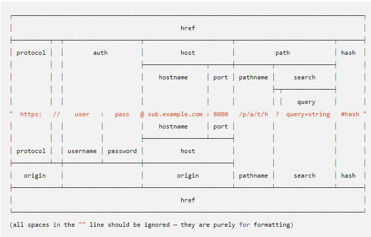

# Day3

## 2019 01.04 Friday

## 1. Node.js

### Node.js 내장객체

* global

javascript에는 2가지 실행환경이 있다.

1. Browser run time environment
2. Node run time environment

두 실행환경의 전역 변수 설정방법이 각각 다르다.

먼저 `Browser`의 경우는 전역 객체를 `window`로 전역 변수를 설정할 수 있다.

```javascript
// browser
var a = 10

console.log(a) // 10
console.log(window.a) // 10
window.console.log(a) // 10
```

위와 같이 전역 변수로 설정한 값을 window 객체에서 불러올 수 있다. 또한, window 객체 없이 그냥 값을 불러올 수도 있는데 이는 browser javascript의 모든 변수 / 함수는 `window` 객체 내부에서 관리되기 때문이다.

반면 `Node`실행 환경에서는 window가 아닌 global을 전역 객체로 가진다.

```javascript
// Node
var a = 10

console.log(a) // 10
console.log(global.a) // undefined
global.console.log(a) // 10
```

위 예시와 같이 global 전역객체를 통해 Node의 내장 객체인 console 객체를 불러 올 수 있다.

다만, `Browser` 실행환경과는 달리 바깥에서 선언한 변수는 global 객체의 변수가 되지 않는다!

`Browser` 실행환경에서는 만약 파일 2개에서 같은 이름으로 전역변수가 선언됐다면 나중에 불려진\(load\) 파일의 변수를 쓴다. 하지만 `Node` 실행환경에서는 전역으로 선언된 변수의 범위는 오직 `파일 내부`로 한정되어있다.

따라서, 다른 모듈에 있는 전역 변수는 같은 이름이더라도 다른 변수로 취급된다.

다른 모듈의 변수와 메서드를 불러오기 위해서는 명시적으로 export된 변수를 import 해야 한다.

#### global 전역 객체에서 자주사용하는 변수 / 메서드

1. \_\_dirname

> 현재 모듈의 directory name을 가진 전역 변수

`__dirname` 변수는 `path.dirname()`과 같은 값을 가진다.

1. \_\_filename

> 현재모듈의 파일의 절대경로를 가진 전역변수 \(현재 시스템의 symlinks\)

[심볼릭 링크란?](https://ko.wikipedia.org/wiki/%EC%8B%AC%EB%B3%BC%EB%A6%AD_%EB%A7%81%ED%81%AC)

1. require\(module name: string\)

> 다른 모듈을 가져오는 global function

```javascript
const util = require("util"); // 내장모듈 util import
const express = require("express"); // 외장모듈 express import
const controller = require("./controller") // 내부 파일모듈 import
```

1. Timer 함수

> setTimeout / setInterval / setImmediate
>
> clearTimeout / clearInterval / clearImmediate

* setTimeout\(callback: function, time: integer\)

  주어진 time\(밀리초, Millsecond\)이후에 콜백 함수를 실행한다. \(1번만\)

  ※ 1000 밀리초에 1초

* setInterval\(callback: function, time: integer\)

  주어진 time\(밀리초, Milisecond\)마다 콜백 함수를 실행한다. \(실행 후 밀리초마다\)

* setImmediate\(callback: function\)

  콜백함수를 즉시 실행하는 타이머 함수

  ```javascript
    setTimeout(function(){
        console.log("1초 지났습니다.");
    }, 1000);

    setTimeout(function(){
        console.log("3초마다 실행")
    }, 3000);

    setImmediate(function(){
        console.log("즉시 실행")
    });
  ```

  위와 같이 타이머 함수를 사용할 수 있다.

  타이머 함수들은 모두 고유한 id를 반환한다. 이 아이디를 이용하여 clear으로 타이머를 취소할 수 있다.

  > setImmediate와 setTimeout\(callback, 0\)
  >
  > 위 두 함수에 담긴 callback은 이벤트 루프를 거친 뒤 즉시 실행된다.
  >
  > 보통의 경우 setTimeout\(callback, 0\)이 setImmediate보다 먼저 실행되지만, 파일 시스템 접근, 네트워킹 등의 I/O 작업 내에서의 callback은 setImmediate가 먼저 호출이 된다.
  >
  > 다만, 의미에 맞게 setTimeout\(callback, 0\)을 사용하기 보다 setImmediate를 사용하는 것이 권장된다.

* 그외..

그외 process, console, module, exports 등의 global 객체는 아래 section에서 더 자세히 다루도록 합니다

[Node.js global 공식문서](https://nodejs.org/api/globals.html) [참고](https://codeburst.io/node-js-getting-started-4c671313a1ae)

* console 객체

> console 객체는 javascript console에서 간단한 디버깅 기록을 제공해준다.

console 객체는 주로 2가지 형태로 사용한다.

1. method 사용
   * console.log\(\)

     javascript 콘솔에서 log에 들어갈 인자를 출력해주는 함수

   * console.error\(\)

     `log()`와 비슷하지만 error 메세지 형태로 콘솔에 출력

     ```javascript
     // 사용사례
     console.log('hello world');
     // Prints: hello world, to stdout
     console.log('hello %s', 'world');
     // Prints: hello world, to stdout
     console.error(new Error('Whoops, something bad happened'));
     // Prints: [Error: Whoops, something bad happened], to stderr

     const name = 'Will Robinson';
     console.warn(`Danger ${name}! Danger!`);
     // Prints: Danger Will Robinson! Danger!, to stderr
     ```
2. console 객체 생성

   console 객체를 커스텀하여 log를 출력할 수 있다.

   ```javascript
    const { Console } = require("console");
    // 또는
    const { Console } = console;
   ```

   위는 console 객체 생성자를 받아오는 코드이다.

   위 Console 생성자로 다음과 같이 console 객체를 생성할 수 있다.

   ```javascript
    new Console(stdout[, stderr][, ignoreErrors])
    new Console(options)
   ```

   위 `options: object`에는 다음과 같은 값이 있을 수 있다.

   * stdout: stream.Writable - 표준출력
   * stderr: stream.Writable - 표준에러
   * ignoreErrors: boolean / default: true

       stream에서 값을 쓸 때 error를 무시할지 말지 여부 결정

   * colorMode: boolean / string\(default: 'auto'\)

     참고로 global console 객체는 다음 Console 개체를 반환한다.

     ```javascript
     new Console({ stdout: process.stdout, stderr: process.stderr });
     ```

[참고](https://nodejs.org/api/console.html)

* process 객체

현재 실행중인 Node.js 프로그램의 실행 `instance` 정보를 가지는 객체

주로 env 변수를 사용한다. \(환경변수를 다루기 위해\)

```javascript
process.env.DB_NAME === "test"
// 환경변수에 등록된 DB_NAME의 값이 "test"인 경우
```

* URL / URLSearchParams

Node.js의 URL은 WHATWG의 URL 표준을 따른다. [WHATWG URL API 참고](https://url.spec.whatwg.org/)



> 중간의 주소 위쪽의 기존의 Node URL 체계, 아래쪽이 WHATWG 방식이다.

URL 객체 생성하기

```text
new URL(input: string[, base: string | url])
```

위 양식으로 URL 객체를 만든다.

input은 파싱할 url이 들어간다. 절대경로, 상대경로 모두 가능하지만 상대경로라면 base는 무조건 필요하다.

```javascript
const testURL = new URL('/foo', 'https://example.org/');
// https://example.org/foo

let myURL = new URL('http://Example.com/', 'https://example.org/');
// http://example.com/

myURL = new URL('https://Example.com/', 'https://example.org/');
// https://example.com/

myURL = new URL('foo://Example.com/', 'https://example.org/');
// foo://Example.com/

myURL = new URL('http:Example.com/', 'https://example.org/');
// http://example.com/

myURL = new URL('https:Example.com/', 'https://example.org/');
// https://example.org/Example.com/

myURL = new URL('foo:Example.com/', 'https://example.org/');
// foo:Example.com/
```

URL 객체의 property는 WHATWG의 구성요소를 가진다.

* hash

  html의 id 속성에 해당하는 정보

  ```javascript
    const myURL = new URL('https://example.org/foo#bar');
    console.log(myURL.hash);
    // Prints #bar

    myURL.hash = 'baz';
  ```

* host

  url의 host 부분을 제공 \(protocol, hostname, port\)

  ```javascript
    const myURL = new URL('https://example.org:81/foo');
    console.log(myURL.host);
    // Prints example.org:81

    myURL.host = 'example.com:82';
  ```

* hostname

  url의 hostname을 제공

  ```javascript
    const myURL = new URL('https://example.org:81/foo');
    console.log(myURL.hostname);
    // Prints example.org

    myURL.hostname = 'example.com:82';
  ```

* href

  현재 등록된 url 전체를 제공해주는 property로 url.toString\(\)과 같은 역할을 한다.

  ```javascript
    const myURL = new URL('https://example.org/foo');
    console.log(myURL.href);
    // Prints https://example.org/foo
  ```

* origin

  url origin 정보 제공 \(단, read-only\)

  ```javascript
    const myURL = new URL('https://example.org/foo/bar?baz');
    console.log(myURL.origin);
    // Prints https://example.org
  ```

* password

  url의 password 정보 제공

* pathname

  url의 pathname 정보 제공, origin 이후에 오는 url에 해당

  ```javascript
    const myURL = new URL('https://example.org/abc/xyz?123');
    console.log(myURL.pathname);
    // Prints /abc/xyz
  ```

* port

  url의 port 정보 제공

* protocol

  url의 protocol 정보 제공

* search

  url에 있는 querystring 목록을 제공 \(string으로 제공\)

* username

  url의 username 정보 제공

※ URLSearchParams

URLSearchParams는 read-only로 querystring parameter를 참조할 수 있다. 만약 querystring을 수정해야한다면 url.search를 이용하여 수정한다.\(URLSearchParams의 setter\)

